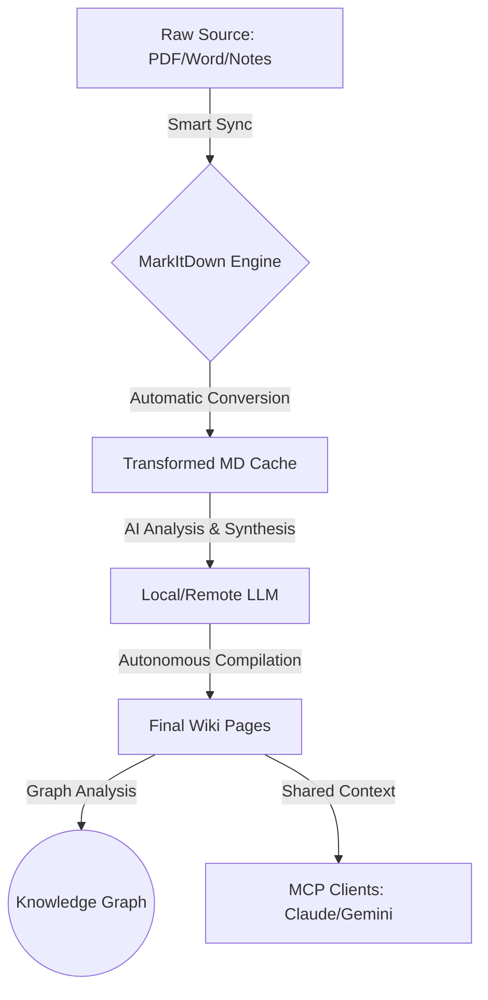

# 🚀 ConnectWikiMCP v1.1.0 Official Manual

> **Building an Autonomous Second Brain with Andrej Karpathy's "LLM Wiki" Philosophy.**

ConnectWikiMCP is a next-generation knowledge management system built as a Model Context Protocol (MCP) server. It enables AI agents to not just search knowledge, but to autonomously **ingest, transform, and compile** information into a structured, interconnected knowledge graph.

---

## 📖 Table of Contents
1. [Introduction](#-introduction)
2. [Intelligence & Graph Features](#-intelligence--graph-features)
3. [System Architecture](#-system-architecture)
4. [Knowledge Lifecycle](#-knowledge-lifecycle)
5. [Installation & Setup](#-installation--setup)
6. [Tool Reference Guide](#-tool-reference-guide)
7. [Smart Prompts (Workflows)](#-smart-prompts-workflows)
8. [Deployment Options](#-deployment-options)

---

## 🧩 Introduction
ConnectWikiMCP is based on the idea of a **"Compiled Knowledge Base"**. Instead of dumping endless notes, the system encourages a workflow where raw information is processed and synthesized by LLMs into high-quality, structured pages. This server acts as the bridge between your raw files and your AI agents' long-term memory.

---

## 🧠 Intelligence & Graph Features (v1.1.0)

### 🕸️ Knowledge Graph & Backlinks
Unlock the power of connected thoughts. The system automatically parses WikiLinks (`[[PageName]]`) and provides:
- **Backlinks**: Find out which pages reference your current topic.
- **Graph Analysis**: See the entire connectivity of your second brain in JSON format.

### 🏷️ Smart Tagging System
Organize notes effortlessly using hashtags (e.g., `#ProjectA`). The AI can use these tags to filter and batch-process information into the correct Wiki pages.

### 🎭 Smart Prompts (AI Workflows)
No more long, repetitive instructions. Use pre-defined **Prompts** in your AI client (like Claude) to trigger complex tasks:
- **Smart Compile**: Give a keyword, and the AI will auto-search, auto-read, and auto-update the Wiki.
- **Wiki Audit**: Ask the AI to find gaps and suggest new connections.

---

## 🏗 System Architecture



---

## 🔄 Knowledge Lifecycle
ConnectWikiMCP manages data in three distinct stages:

| Stage | Folder | Purpose |
| :--- | :--- | :--- |
| **Input** | `raw/` | Where you drop your PDFs, Word docs, or quick raw notes. Supports `#tags`. |
| **Process** | `transformed/` | Automated high-quality Markdown versions of your raw files. |
| **Output** | `pages/` | The final Wiki! Interconnected via `[[Links]]`. |

---

## 🚀 Installation & Setup

### Local Installation
```bash
# 1. Clone & Enter
git clone https://github.com/Mins87/ConnectWikiMCP.git
cd ConnectWikiMCP

# 2. Setup Environment
pip install -r requirements.txt

# 3. Launch Server (Windows)
$env:PYTHONPATH="src"; python src/server.py
```

---

## 🛠 Tool Reference Guide

### 📂 Wiki Management
- **`read_page(name)`**: Accesses a finalized Wiki entry.
- **`write_page(name, content)`**: Direct edit or creation of a Wiki entry.
- **`list_pages()`**: Displays the index of all knowledge pages.
- **`search_wiki(query)`**: High-speed full-text search.
- **`get_backlinks(name)`**: **(New)** Find all pages that link to this one.
- **`get_graph()`**: **(New)** Retrieve the full node-link graph data.

### ⚙️ Data Pipeline
- **`ingest_raw(name, content)`**: For quick "brain dumps" into `raw/`.
- **`read_raw(path)`**: Reads any file in `raw/`, auto-converting if needed.
- **`sync_raw()`**: Batch synchronizes the entire raw folder.
- **`auto_archive_by_tag(tag)`**: **(New)** Finds all raw notes with a specific #tag.

### 🧠 Intelligence
- **`compile_with_local_llm(raw_filename, target_page_name)`**: Autonomous compilation.
- **`set_config(...)`**: Update server behavior (LLM model, API URLs) in real-time.

---

## 🎭 Smart Prompts (Workflows)
You can find these in the **Prompts** tab of your MCP Client:

- **`smart_compile(keyword)`**: Focuses the AI on building/updating a specific topic.
- **`wiki_audit()`**: Performs an overall quality and connectivity check of your Wiki.

---

## 🚢 Deployment Options
```bash
# Using Docker Compose
docker-compose run connect-wiki-mcp
```

---

> **ConnectWikiMCP** - *Empowering AI to build better knowledge.*
