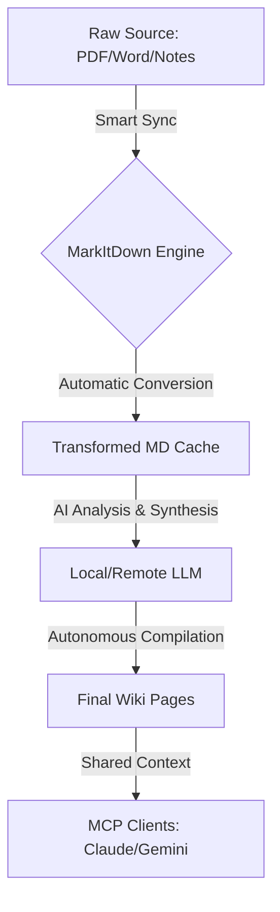

# 🚀 ConnectWikiMCP v1.0.0 Official Manual

> **Building an Autonomous Second Brain with Andrej Karpathy's "LLM Wiki" Philosophy.**

ConnectWikiMCP is a next-generation knowledge management system built as a Model Context Protocol (MCP) server. It enables AI agents to not just search knowledge, but to autonomously **ingest, transform, and compile** information into a structured human-and-AI-readable Wiki.

---

## 📖 Table of Contents
1. [Introduction](#-introduction)
2. [System Architecture](#-system-architecture)
3. [Key Features](#-key-features)
4. [Knowledge Lifecycle](#-knowledge-lifecycle)
5. [Installation & Setup](#-installation--setup)
6. [Tool Reference Guide](#-tool-reference-guide)
7. [Deployment Options](#-deployment-options)
8. [Configuration](#-configuration)

---

## 🧩 Introduction
ConnectWikiMCP is based on the idea of a **"Compiled Knowledge Base"**. Instead of dumping endless notes, the system encourages a workflow where raw information is processed and synthesized by LLMs into high-quality, structured pages. This server acts as the bridge between your raw files and your AI agents' long-term memory.

---

## 🏗 System Architecture



---

## ✨ Key Features

### 📡 Shared Multi-Agent Context
By using the MCP standard, ConnectWikiMCP acts as a centralized brain. Any modification made by one AI agent is instantly reflected across all other connected services.

### 🔄 Intelligent Pipeline (MarkItDown Integration)
Natively integrated with **Microsoft MarkItDown**, the server flawlessly handles complex document types. It tracks file modification times (`mtime`) to ensure that your Markdown cache is always up-to-date without redundant processing.

### 🤖 LLM-Powered Synthesis
The `compile_with_local_llm` tool allows the AI to act as an editor, taking rough raw data and formatting it into beautiful, cross-linked Wiki pages.

---

## 🔄 Knowledge Lifecycle
ConnectWikiMCP manages data in three distinct stages:

| Stage | Folder | Purpose |
| :--- | :--- | :--- |
| **Input** | `raw/` | Where you drop your PDFs, Word docs, or quick raw notes. |
| **Process** | `transformed/` | Automated high-quality Markdown versions of your raw files. |
| **Output** | `pages/` | The final Wiki! Structured, cross-referenced, and ready to read. |

---

## 🚀 Installation & Setup

### Local Installation
```bash
# 1. Clone & Enter
git clone https://github.com/your-repo/ConnectWikiMCP.git
cd ConnectWikiMCP

# 2. Setup Environment
pip install -r requirements.txt

# 3. Launch Server (Windows)
$env:PYTHONPATH="src"; python src/server.py

# 3. Launch Server (Linux/macOS)
PYTHONPATH=src python3 src/server.py
```

---

## 🛠 Tool Reference Guide

### 📂 Wiki Management
- **`read_page(name)`**: Accesses a finalized Wiki entry.
- **`write_page(name, content)`**: Direct edit or creation of a Wiki entry.
- **`list_pages()`**: Displays the index of all knowledge pages.
- **`search_wiki(query)`**: High-speed full-text search across the compiled Wiki.

### ⚙️ Data Pipeline
- **`ingest_raw(name, content)`**: For quick "brain dumps" into the raw directory.
- **`read_raw(path)`**: Reads any file in `raw/`, converting binaries on-the-fly.
- **`sync_raw()`**: Batch synchronizes the entire raw folder into Markdown.

### 🧠 Intelligence
- **`compile_with_local_llm(raw_filename, target_page_name)`**: The magic button. It reads the raw file and asks the configured LLM to write a formal Wiki page.
- **`set_config(...)`**: Update server behavior (LLM model, API URLs) in real-time.

---

## 🚢 Deployment Options

### Docker Deployment
For a consistent environment, use our official Docker configuration:
```bash
# Build and Run with Compose
docker-compose run connect-wiki-mcp
```
> [!IMPORTANT]
> Ensure your `wiki/` directory is mounted correctly to persist your data.

---

## ⚙️ Configuration
The server creates a `wiki/config.json` on the first run.

- **`WIKI_ROOT_PATH`**: Where all your data lives.
- **`LOCAL_LLM_TYPE`**: Supports `ollama`, `llamacpp`, and `external` (OpenAI-compatible).
- **`LOCAL_LLM_API_URL`**: The endpoint for your inference engine.
- **`LOCAL_LLM_MODEL`**: The specific model (e.g., `llama3`, `gemma4-E4B-it`).

---

> **ConnectWikiMCP** - *Empowering AI to build better knowledge.*
